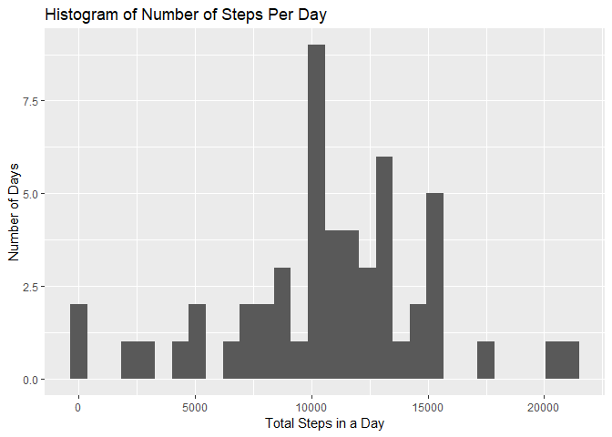
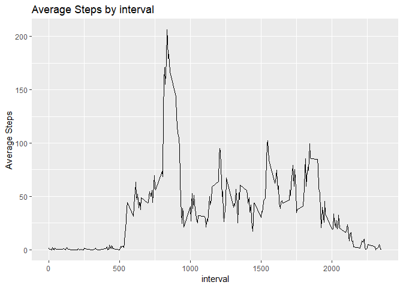
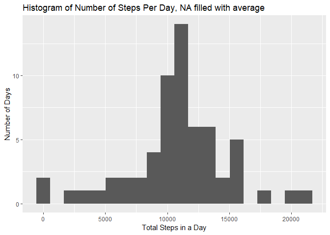
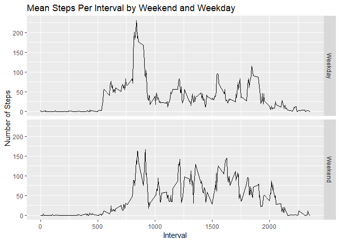

## Loading and preprocessing the data

First we'll load the activity.csv from the downloaded dataset and the transform the 'Date' column into the date format.

```r
activity<-read.csv("activity.csv")
activity$date<-as.Date(activity$date, format="%Y-%m-%d")
```


Then we'll sum the steps aggregated by date

```r
stepsbyday<-aggregate(activity$steps,by=list(Date=as.Date(activity$date)),FUN=sum)
```


## What is mean total number of steps taken per day?

We'll look at a histogram of the total steps in a day.


```r
library(ggplot2)
qplot(stepsbyday$x, data=stepsbyday, geom="histogram", xlab="Total Steps in a Day", ylab="Number of Days", main="Histogram of Number of Steps Per Day")
```

```
## `stat_bin()` using `bins = 30`. Pick better value with `binwidth`.
```

```
## Warning: Removed 8 rows containing non-finite values (stat_bin).
```

<!-- -->

## What is the average daily activity pattern?

Then we'll look at the mean and median steps by day.


```r
meansteps<-mean(stepsbyday$x,na.rm = TRUE)
mediansteps<-median(stepsbyday$x,na.rm = TRUE)
meansteps
```

```
## [1] 10766.19
```

```r
mediansteps
```

```
## [1] 10765
```

Now we'll take the mean of the steps aggregated by the interval and insert into a new frame.


```r
stepsbyinterval<-aggregate(activity$steps,by=list(interval=activity$interval),FUN=mean, na.rm=TRUE)
```

Then plot the mean of the steps by interval


```r
qplot(x=interval, y=x, data=stepsbyinterval, geom="line",ylab="Average Steps", main="Average Steps by interval")
```

<!-- -->

Max steps.


```r
maxsteps<-stepsbyinterval[stepsbyinterval$x==max(stepsbyinterval$x),]
maxsteps
```

```
##     interval        x
## 104      835 206.1698
```

## Imputing missing values

We'll see how many values we're missing


```r
nummissing<-sum(is.na(activity$steps))
nummissing
```

```
## [1] 2304
```

We'll fill in the missing values with the mean steps of that interval


```r
myfxn<-function(steps, interval)
      {if(is.na(steps)==TRUE)
          {stepsbyinterval[stepsbyinterval$interval==interval,2]}
      else{steps}}
activityfilled<-activity
activityfilled$steps<-mapply(myfxn, activity[,1],activity[,3])
```

No we'll re-plot the histogram with the filled in data. This moves the histogram to the right and makes it taller.


```r
filledstepsbyday<-aggregate(activityfilled$steps,by=list(Date=as.Date(activityfilled$date)),FUN=sum)
qplot(filledstepsbyday$x, data=filledstepsbyday, geom="histogram", xlab="Total Steps in a Day", ylab="Number of Days", main="Histogram of Number of Steps Per Day, NA filled with average", bins=20)
```

<!-- -->

Finding the mean and median steps of the filled data


```r
meanstepsfilled<-mean(filledstepsbyday$x,na.rm = TRUE)
medianstepsfilled<-median(filledstepsbyday$x,na.rm = TRUE)
meanstepsfilled
```

```
## [1] 10766.19
```

```r
medianstepsfilled
```

```
## [1] 10766.19
```

## Are there differences in activity patterns between weekdays and weekends?

Creating a factor of "Weekday" and "Weekend"


```r
activityfilled$Weekend<-factor(weekdays(as.Date(activityfilled$date), abbreviate=FALSE), levels=c("Monday", "Tuesday", "Wednesday","Thursday","Friday","Saturday","Sunday"),labels = c("Weekday","Weekday","Weekday","Weekday","Weekday","Weekend", "Weekend"))
```

Aggregating on interval and whether it's a weekday or weekend


```r
stepsbyintervalandweekend<-aggregate(activityfilled$steps,by=list(interval=activityfilled$interval, weekend=activityfilled$Weekend),FUN=mean, na.rm=TRUE)
```

Make a new line plot of steps by interval broken out into weekend and weekday


```r
qplot(x=interval, y=x, data=stepsbyintervalandweekend, facets=stepsbyintervalandweekend$weekend~., geom="line", xlab="Interval",ylab="Number of Steps", main="Mean Steps Per Interval by Weekend and Weekday")
```

<!-- -->
